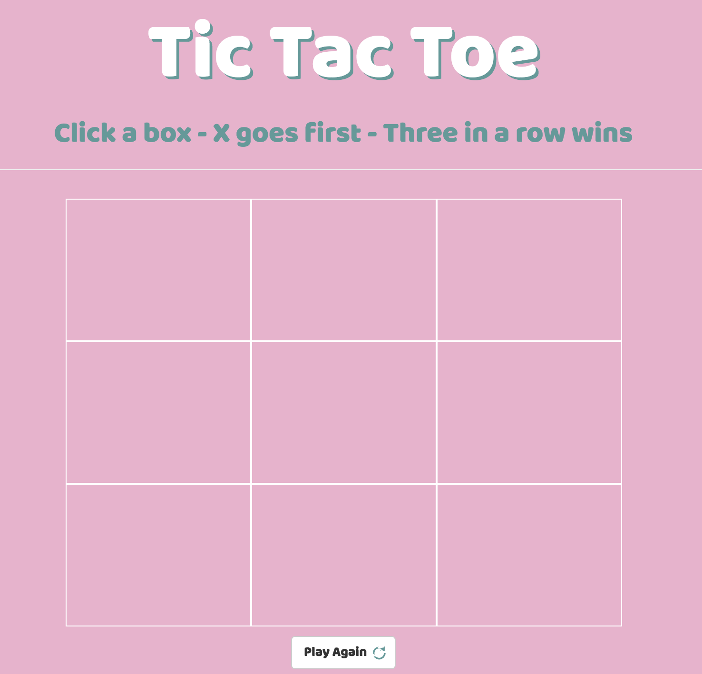

# Tic Tac Toe Game

## Objective

Create a tic-tac-toe game that uses Xs and Os to represent two players and logic to check for a winner after three of a kind are played in a row.

## Technologies Used
* HTML  
* CSS
* JavaScript (jQuery)

## Code Examples

One big challenge was how to handle two players. I did this using the modulus operator and forced the game to start with player X.

```
$(".box").on("click", function handleClick() {

  play++;

  if (!$(this).hasClass("x") && !$(this).hasClass("o")) {

    if (play % 2 == 0) {
      $(this).text("o");
      $(this).addClass("o");
    }

    else {
      $(this).text("x");
      $(this).addClass("x");
    }

  };

  playerArrays();

});
```

Another big challenge was creating the function to check for a winner. I ended up creating the winner arrays then checking populated X and O arrays against those winner arrays.

```

function checkforWin (playerArray) {

  var winningArrays = [["1", "2", "3"], ["4", "5", "6"], ["7", "8", "9"],
  ["1", "5", "9"], ["3", "5", "7"], ["1", "4", "7"], ["2", "5", "8"],
  ["3", "6", "9"]];

  var playerArrayIncludes = function (element) {
    return playerArray.includes(element);
  }

  for (var i = 0; i < winningArrays.length; i++) {

    var arr = winningArrays[i];

    if (arr.every(playerArrayIncludes)) {
      return true;
    }
  }

  return false;
}
```
## Screenshots


